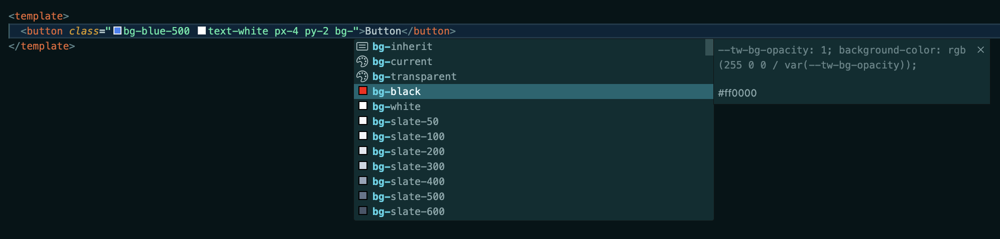

---
# You can also start simply with 'default'
# random image from a curated Unsplash collection by Anthony
# like them? see https://unsplash.com/collections/94734566/slidev
# some information about your slides (markdown enabled)
title: Tailwind CSS
# apply unocss classes to the current slide
class: text-center
# https://sli.dev/features/drawing
drawings:
  persist: false
# slide transition: https://sli.dev/guide/animations.html#slide-transitions
transition: slide-left
# enable MDC Syntax: https://sli.dev/features/mdc
mdc: true
---

# Tailwind CSS

---
---

# 話すこと

- Tailwind CSSってなーに
- いいところ
- わるいところ
- FAQ
- まとめ

---
layout: section
level: 2
---

# Tailwind CSSってなーに

---
layout: default
---

## Tailwind CSSってなーに
<br>

- ユーティリティファーストの CSS フレームワーク
  - ユーティリティファーストとは、CSSフレームワークの設計哲学の一つで、特定のスタイルを適用するための小さなクラス（ユーティリティクラス）を多用するアプローチのこと。
  - 現環境のmt-mdやtext-centerと同じように、現在あるCSSのプロパティほぼ全てをユーティリティクラスに落とし込んだもの
  - tailwind.configを設定することで、クラスに好きな値を設定できる
- 世界的に人気なCSSフレームワーク
  - 利用満足度は2019年から今までほぼ1位
  - 利用率は2021年から2位（1位はbootstrap）
  - デジタル庁のサイトでも使われてた

---
layout: two-cols-header
layoutClass: gap-5
---


::left::

## 通常
```html
<button class="button">ボタン</button>
<style>
.button {
  /* bg-blue-500 */
  background-color: rgb(59 130 246);
  /* text-white */
  color: #fff;
  /* py-2 px-4 */
  padding: 0.5rem 1rem;
  /* rounded-md */
  border-radius: 0.375rem;

  &:hover {
    /* hover:bg-blue-700 */
    background-color: rgb(37 99 235);
  }
}
</style>
```

::right::

## Tailwind CSS

```html
<button
  class="bg-blue-500 text-white px-4 py-2 rounded-md hover:bg-blue-700"
>
  ボタン
</button>
```

---
layout: default
---

### tailwind.configにデザインシステムを反映できる
````md magic-move {lines: true}
```js
export default {
  theme: {
    extend: {
      colors: {
        transparent: 'transparent',
        current: 'currentColor',
        black: '#000',
        white: '#ffffff',
        gray: {
          1: '#4a5f62',
          2: '#677d7f',
        },
      },
    },
  },
}
```

```js {7}
export default {
  theme: {
    extend: {
      colors: {
        transparent: 'transparent',
        current: 'currentColor',
        black: '#000',
        white: '#ffffff',
        gray: {
          1: '#4a5f62',
          2: '#677d7f',
        },
      },
    },
  },
}
```

```js {7}
export default {
  theme: {
    extend: {
      colors: {
        transparent: 'transparent',
        current: 'currentColor',
        black: 'red',
        white: '#ffffff',
        gray: {
          1: '#4a5f62',
          2: '#677d7f',
        },
      },
    },
  },
}
```
````

```html
<p class="text-black">hello</p>
```

出力結果：<span v-click.hide="+2" class="text-[#000]">hello</span><span v-click.show="+2" class="text-red ml-[-40px]">hello</span>


---
layout: iframe
url: https://2023.stateofcss.com/ja-JP/css-frameworks/
---


---
layout: section
---

# いいところ

---
layout: default
---

## いいところ
<br>

- ドキュメントが整備されている＆勝手に更新される
- デザインシステムを反映しやすい
- <span v-mark.red="1">クラス名を考えなくていい</span>
- <span v-mark.red="1">開発時のビルドは不要</span>
- <span v-mark.red="1">クラス名の補完が効く</span>
- <span v-mark.red="1">重複CSSを削減できる</span>

---
layout: default
---
### クラス名を考えなくていい
Tailwindcssの一番の恩恵だと思っています。
#### クラス名を考えなくて良くなるメリット
- 純粋に楽
- クラス名が他で使用されていないか気にしなくていい
- クラス名に一貫性が生まれる  
通常の命名だと実装者によってばらつきが出る。  
例  
text or txt  
button or btn  
outerの次はinner or container

---
layout: two-cols-header
layoutClass: gap-x-5
---
### 開発時のビルドは不要
ユーティリティクラスを使用する分には、最初のパッケージインストール以降はビルドは不要です。  
環境負荷が下がってとっても嬉しい
#### いつビルドが必要？
- tailwind.configを編集した場合  
コンフィグの内容をクラスに反映するため
- デプロイ時  
使用していないCSSを削除するため

```html
<button class="bg-red-100">ボタン</button>
```

::left::
ビルド前
```css
.bg-red-100 {
  background-color: #ff000f;
}
.bg-red-200 {
  background-color: #ff001f;
}
```

::right::
ビルド後
```css
.bg-red-100 {
  background-color: #ff000f;
}
```

---
layout: default
---
### クラス名の補完が効く
VSCodeに拡張機能を入れることによって、クラス名の入力が補完されます。  
（InteliJも対応してるっぽい）



---
layout: two-cols-header
layoutClass: gap-5
---
### 重複CSSを削減できる
utilityクラスの使い回しなので、いくらクラスを書きまくろうが反映されるCSSは一つ。  
積み重なっていくCSSが減り、容量が重くなりづらい。

::left::
#### 通常のCSS
```css
.container {
  display: flex;
  gap: 0.75rem;
  align-items: center;
}
.box {
  display: flex;
  justify-content: center;
  gap: 0.75rem;
}
.list {
  display: flex;
  justify-content: center;
  align-items: center;
  gap: 0.75rem;
}
```

::right::
#### Tailwind CSS
```css
.flex {
  display: flex;
}
.justify-center {
  justify-content: center;
}
.items-center {
  align-items: center;
}
.gap-3 {
  gap: 0.75rem;
}
```

---
layout: section
<!-- https://qiita.com/70ki8suda/items/76209ea566bab4ba1268 -->
<!-- https://qiita.com/NagayamaToshiaki/items/4f8fd7773545e4f4c009 -->
<!-- https://yuheiy.hatenablog.com/entry/2020/05/25/021342 -->
---

# わるいところ

---
layout: default
---

## わるいところ
<br>

  <ul v-mark="{ at: 1, color: 'orange', type: 'circle' }">
    <li>セマンティックではなく、要素の役割がわかりづらい</li>
    <li>可読性が悪い</li>
    <!-- <li>既存ユーティリティクラスとバッティングする可能性がある</li> -->
    <li>複数箇所で使用されているコンポーネントの修正がめんどい</li>
  </ul>

- CSSの便利機能が使えない

---
layout: default
---
````md magic-move {lines: true}
```html
<a
  class="card-wrapper group pointer-events-auto relative grid aspect-square h-full w-full grid-rows-[1fr_auto] gap-3 rounded-lg group-[.is]/marker:!grid-rows-[200px_auto] sm:aspect-auto sm:grid-rows-[294px_auto] p-2"
>
  <div
    class="scrollbar-hide pointer-events-auto relative inset-0 flex snap-x snap-mandatory overflow-x-auto w-full object-cover group-[.is]/marker:rounded-b-none h-full"
  >
    
    
  </div>
  <button
    class="pointer-events-auto absolute top-1/2 z-50 hidden h-7 w-7 -translate-y-1/2 place-items-center rounded-full bg-black/40 text-w-3005 opacity-0 backdrop-blur-xs transition-opacity hover:text-white group-hover:opacity-100 md:grid left-4"
  >
  </button>
  <button
    class="pointer-events-auto absolute top-1/2 z-50 hidden h-7 w-7 -translate-y-1/2 place-items-center rounded-full bg-black/40 text-w-3005 opacity-0 backdrop-blur-xs transition-opacity hover:text-white group-hover:opacity-100 md:grid right-4"
  >
  </button>
  <div
    class="group-[.is]/marker:rounded-b-lg group-[.is]/marker:bg-black group-[.is]/marker:px-3 group-[.is]/marker:pb-3"
  >
    <div class="mb-0.5 flex items-center gap-2 font-medium">
      Wander Waikōloa Beach
    </div>
  </div>
</a>
```

```html
<a
  class="beach-introduction-card"
>
  <div
    class="slider"
  >
    
    
  </div>
  <button
    class="slider-next-button"
  >
  </button>
  <button
    class="slider-prev-button"
  >
  </button>
  <div
    class="beach-detail-box"
  >
    <div class="beach-name">
      Wander Waikōloa Beach
    </div>
  </div>
</a>
```

```jsx
<a
  class="beach-introduction-card"
>
 <Slider>
    
    
  </Slider>
  <AreaDetail
    title="Wander Waikōloa Beach"
  />
</a>
```
````
<br>
<v-click at="3">
コンポーネント管理がされていれば可読性は下がらないしセマンティックは保てる<br>
逆にコンポーネント化をきちんと行わないと負債化するかも
</v-click>

---
layout: default
transition: fade-out
---
### CSSの便利機能が使えない
<br>

<div>
  <p>CSSのいろんな機能が使えません。</p>
  <ul>
    <li>コンテナクエリ</li>
    <li>hasセレクタ</li>
    <li>直下セレクタ（>）</li>
    <li>等々</li>
  </ul>
</div>

<div v-click.hide="[0]">
  <p>と思ってました</p>
</div>

---
layout: default
---
### CSSの便利機能使えます
<br>
```html
<!-- コンテナクエリ -->
<div class="@container">
  <div class="block @lg:flex">
    <!-- ... -->
  </div>
</div>

<!-- hasセレクタ -->
<div class="has-[p]:bg-black">
  <p>hello</p>
</div>

<!-- 直下セレクタ -->
<ul class="[&>li]:p-4">
  <li>{item}</li>
  <li>{item}</li>
</ul>
```
---
layout: section
---

# FAQ

---
layout: default
---

### Q：任意の値を使えるようにしたくない（かえP氏）
任意の数値を指定できるArbitrary values
```html
<div class="mt-[50px] height-[50%] rounded-[12px] text-[1.5rem]">
  <!-- ... -->
</div>
```
<br>

### A：eslintでルール追加できます

https://github.com/francoismassart/eslint-plugin-tailwindcss/blob/master/docs/rules/no-arbitrary-value.md

---
layout: default
---

### Q：style属性に直接書くのと何が違うの（老氏）
```html
<!-- tailwind -->
<div class="mt-[50px] height-[50%] rounded-[12px] text-[1.5rem]">
  <!-- ... -->
</div>
<!-- style属性 -->
<div style="margin-top: 50px;height: 50%;border-radius: 12px;font-size: 1.5rem;">
  <!-- ... -->
</div>
```
<br>

### A：style属性だとmediaクエリや擬似要素等が使えないです

```html
<!-- tailwind -->
<div class="mt-[50px] md:mt-10 before:w-2">
  <!-- ... -->
</div>
```

---
layout: default
---

### Q：HTML3.2の時代に戻ってね？（シティボーイ沼田氏）
せっかくHTML5で関心の分離が行われたのに元に戻しちゃってるのでは？  
時代を逆行するTailwindはFailwindだ
```html
<!-- HTML3.2 -->
<center>
  <table cellpadding="0" cellspacing="8" border="0">
    <tr>
      <td><a href="#"><font color="#777777"><b>Home</b></font></a></td>
    </tr>
  </table>
</center>

```

### A：[Tailwindの作者の回答](https://yuheiy.hatenablog.com/entry/2020/05/25/021342)

Tailwindアンチの方々の記事  
https://x.gd/zk8IK  
https://qiita.com/70ki8suda/items/76209ea566bab4ba1268  
https://medium.com/codex/the-fail-of-tailwind-the-go-to-for-the-ignorant-7b0aaea405bb  
https://medium.com/codex/html-illiteracy-part-2-of-2-styling-and-failwind-stupid-f4867d13595a

---
layout: section
---
# まとめ

---
layout: default
---
### 懸念はあるけど導入してもいい気がしている
- 